# Releasing

A release is **a change-log entry**, **a version number** and **two pull requests**. GitHub Actions
does the rest: it checks everything before you can merge, builds the installer, and drafts the
release for you to publish.

```
feature branch --PR--> v3-development --PR--> releases --(automatic)--> draft release --(you)--> Publish
```

The examples and screenshots below are from `3.0.0-alpha.2`; use your own version in its place.

## Writing a change-log entry

Every pull request that changes something a user would notice adds a bullet under `## Unreleased`
in [`ChangeLog.md`](../../ChangeLog.md), under the `###` heading it belongs to (the comment at the top
of the file lists them). Those bullets become the release notes users read on GitHub and in
FE-Buddy's update window, so write them for users:

- **What changed for the user, in a line or two** - not the commit message, not how the code works.
- **Bugs:** `Bug #215 - ` then what is fixed. `#215` becomes a link.
- **Developer-only changes** (refactors, CI, tests) go under `### Dev notes`, always last.
- **Link a doc at the release's tag** (`blob/3.0.0-alpha.2/docs/...`), never a branch: the branch
  keeps changing and the notes don't.

| Instead of | Write |
|---|---|
| `- fix #215` | `- Bug #215 - Fixed the download bar stalling when the next cycle's d-TPP data isn't out yet.` |
| `- Added ExportSettingsCommand to SettingsViewModel` | `- Settings can now be exported to a file and imported on another PC.` |

## Making a release

### Part 1 - Get `v3-development` ready

1. **Merge everything that belongs in the release** into `v3-development`. Check nothing is still
   [open](https://github.com/Nikolai558/FE-BUDDY/pulls?q=is%3Apr+is%3Aopen+base%3Av3-development)
   ([Figure 1](#figure-1)).

2. **Set the version.** In `FeBuddy/FeBuddy.Wpf/FeBuddy.Wpf.csproj`, set
   `<Version>3.0.0-alpha.2</Version>` - the only place the version lives ([Figure 2](#figure-2)). It
   must be exactly one step after the
   [latest release](https://github.com/Nikolai558/FE-BUDDY/releases):

   | Latest release | Next can be |
   |---|---|
   | `3.0.0-alpha.1` | `3.0.0-alpha.2`, `3.0.0-beta.1`, `3.0.0-rc.1` or `3.0.0` |
   | `3.0.0-beta.3` | `3.0.0-beta.4`, `3.0.0-rc.1` or `3.0.0` |
   | `3.0.0` | `3.0.1`, `3.1.0` or `4.0.0`, or any of those with `-alpha.1`, `-beta.1` or `-rc.1` |

   Bug fixes only: PATCH. New features: MINOR. Breaking changes: MAJOR. See [Versioning](VERSIONING.md).

3. **Update the change log.** Rename `## Unreleased` to `## 3.0.0-alpha.2`, and above it add a new
   `## Unreleased` with a `---` line under it. Keep a blank line above and below every `---`
   ([Figure 3](#figure-3)).

   ```markdown
   ## Unreleased

   ---

   ## 3.0.0-alpha.2
   ### AIRAC Service
   - Bug #251 - Fixed ...

   ---

   ## 3.0.0-alpha.1
   ```

   Read the bullets once more: they are the release notes. (The `---` lines stay in the change log;
   the notes leave them out.)

4. **Merge steps 2 and 3** in one pull request into `v3-development` once its checks are green
   ([Figure 5](#figure-5)). To run the release checks on your own PC first (needs the .NET 10 SDK and
   the GitHub CLI, signed in - [Figure 4](#figure-4)):

   ```bash
   powershell -ExecutionPolicy Bypass -File .github/scripts/Test-ReleaseReadiness.ps1
   ```

   `.github/scripts/Build-ReleaseAssets.ps1` also builds the MSI and writes the release notes to
   `FeBuddy/releases/release-notes.md`.

### Part 2 - The release pull request

5. **Open a pull request from `v3-development` into `releases`**:
   [start it here](https://github.com/Nikolai558/FE-BUDDY/compare/releases...v3-development?expand=1).
   Check it says **base: `releases`**, **compare: `v3-development`**, and title it
   `Releasing v3.0.0-alpha.2` ([Figure 6](#figure-6)).

6. **Wait for every check to go green** ([Figure 7](#figure-7)):

   | Check | What it checks |
   |---|---|
   | Build, Test, CodeQL | The same as every pull request. |
   | Release source | The pull request is from `v3-development`. |
   | Release pre-flight | The version is one step after the last release and not released yet; `ChangeLog.md` has its section, newest, with `## Unreleased` empty; developer mode is off; the installer-counter token works; the MSI builds with the right version and 2.x's upgrade identity; the release notes render. |

   - **Checks > Release checks > Release pre-flight > Summary** shows exactly what the release notes
     will say ([Figure 8](#figure-8)); the **release-preview** artifact there has the MSI.
   - A check failed? The summary says why. Fix it with a pull request into `v3-development`; the
     release pull request picks it up and runs again.
   - **"This branch is out-of-date with the base branch" is normal** - every release leaves a merge
     commit on `releases`. It doesn't block the merge. **Never click Update branch**: that merges
     `releases` back into `v3-development`.

7. **Merge it** with a merge commit. Unsigned commits block the merge; once every check is green, a
   repository admin can tick the bypass box and merge ([Figure 9](#figure-9)).

### Part 3 - Publish

8. **Wait for the draft.** The **Release** workflow
   ([Actions > Release](https://github.com/Nikolai558/FE-BUDDY/actions/workflows/release.yml)) builds
   the MSI, commits the advanced installer counter to `v3-development`, and creates a draft release.
   Its summary links to the draft ([Figure 10](#figure-10), [Figure 11](#figure-11)).

9. **Check the draft.** In [Releases](https://github.com/Nikolai558/FE-BUDDY/releases), click the
   pencil on the **Draft** ([Figure 12](#figure-12)):

   | Item | Should be |
   |---|---|
   | Tag | `3.0.0-alpha.2` (no `v`) |
   | Target | `releases` |
   | Title | `v3.0.0-alpha.2` |
   | Notes | Read well. If you edit them here, fix `ChangeLog.md` to match afterwards. |
   | Assets | `FE-BUDDY-Setup.msi` |
   | Release label | `-alpha`, `-beta` or `-rc`: **Pre-release**. Stable: **Latest**. |

   ([Figure 13](#figure-13), [Figure 14](#figure-14))

10. **Publish release.** That creates the tag, and FE-Buddy starts offering the update on that
    release's channel ([Figure 15](#figure-15)). Only a repository admin can publish, since only they
    can create tags.

## Good to know

- The release workflow adds a commit to `v3-development` (the installer counter), so pull before
  starting new work.
- Don't merge another release pull request while a draft is waiting: publish or delete it first.
- The installer is always `FE-BUDDY-Setup.msi`, so
  `https://github.com/Nikolai558/FE-BUDDY/releases/latest/download/FE-BUDDY-Setup.msi` is always the
  latest **stable** release.

## When something goes wrong

- **The Release workflow failed after the merge** - open the run to see why. For something outside
  the code (a GitHub outage), re-run it: **Actions > Release > Run workflow** on `releases`. If it
  created a draft, delete that first.
- **A deliberate exception to the one-step rule** (a number skipped and never released) - add the
  `skip-version-step` label to the release pull request.
- **"Installer-counter token" failed** - the `RELEASE_COUNTER_PAT` secret has expired or lost access.
  Make a new fine-grained token (repository `Nikolai558/FE-BUDDY`, **Contents: Read and write**) on
  an account that can bypass the `v3-development` ruleset, and save it under **Settings > Secrets
  and variables > Actions**.
- **A published release was wrong** - tags can't be moved or deleted. Fix it and release the next
  version.

## Branch protection

Rulesets protect `v3-development`, `releases` and 2.x's `development`, and every tag. Only the
repository admins can bypass them. Changes reach those branches only by pull request, as a merge
commit, once the required checks pass (`releases` also needs signed commits); nobody can push,
force-push, delete or re-create them. Only the admins can create, move or delete a tag. Other
branches are unrestricted.

## What does what

| Piece | Does |
|---|---|
| `ChangeLog.md` | Every 3.x release's notes. 2.x's are in the [2.x change log](https://github.com/Nikolai558/FE-BUDDY/blob/2.9.3/ChangeLog.md). |
| `.github/workflows/release-checks.yml` | On pull requests into `releases`: Release source and Release pre-flight. |
| `.github/workflows/release.yml` | On a merge into `releases`: checks again, builds, commits the counter, drafts the release. |
| `.github/scripts/Test-ReleaseReadiness.ps1` | The checks that need no build. |
| `.github/scripts/Build-ReleaseAssets.ps1` | Builds and checks the MSI; writes the release notes. |
| `.github/scripts/Push-InstallerCounter.ps1` | Commits the advanced installer counter to `v3-development`. |
| `.github/scripts/ReleaseVersion.cs` | The version rules, from `FeBuddy.Versioning` (`ReleaseStep`). |
| `.github/release-notes-template.md` | The release notes' layout: pre-release note, install steps, change log. |

## Figures

<a id="figure-1"></a>
**Figure 1 - Nothing left open**

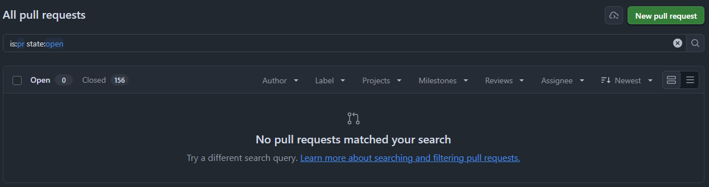

<a id="figure-2"></a>
**Figure 2 - The version change in `FeBuddy.Wpf.csproj`**

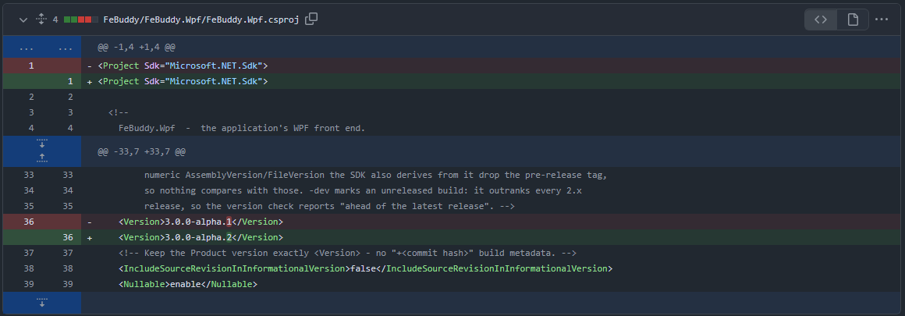

<a id="figure-3"></a>
**Figure 3 - The change in `ChangeLog.md`**

From before a `---` also went under `## Unreleased` and the `###` headings were added; follow the
example in step 3.

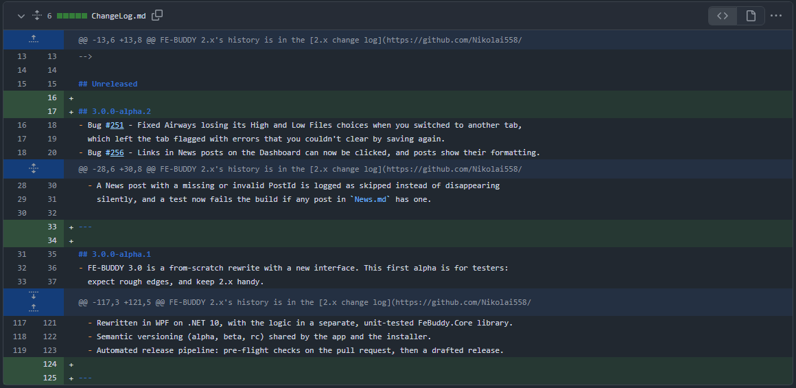

<a id="figure-4"></a>
**Figure 4 - Optional: the release checks on your own PC**

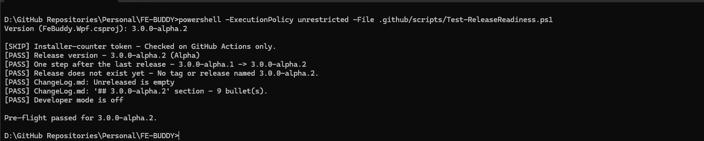

<a id="figure-5"></a>
**Figure 5 - The `v3-development` pull request, green and ready to merge**

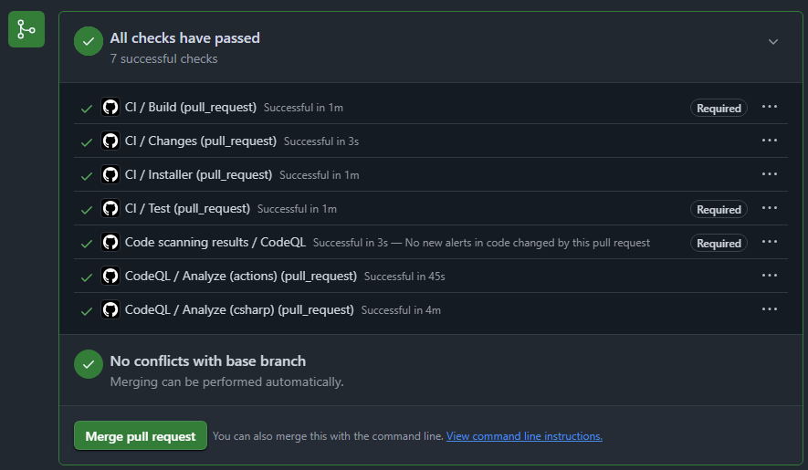

<a id="figure-6"></a>
**Figure 6 - Opening the release pull request: base `releases`, compare `v3-development`**

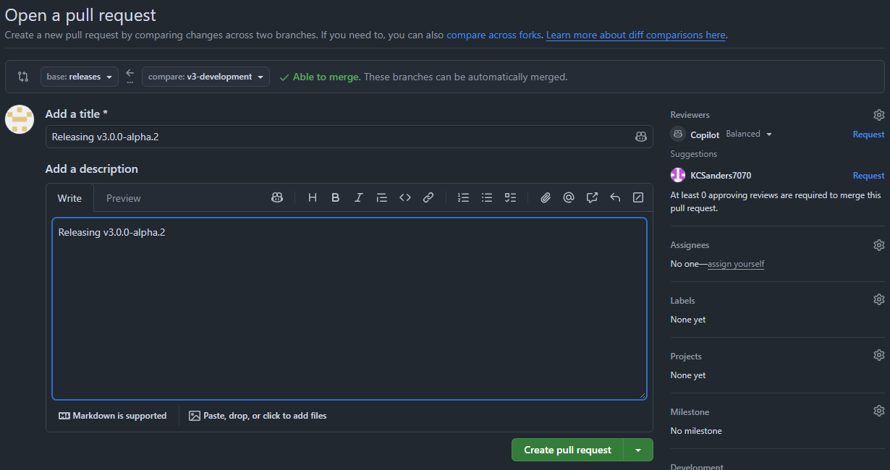

<a id="figure-7"></a>
**Figure 7 - Every check green; Release pre-flight and Release source are Required. Ignore "out-of-date".**

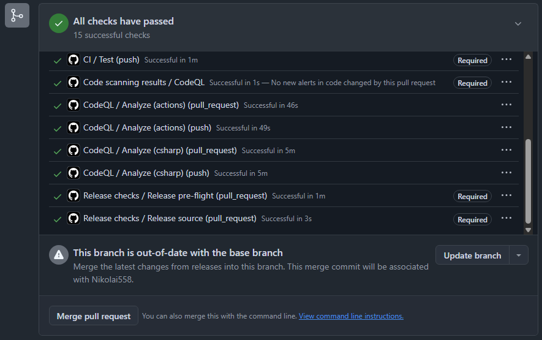

<a id="figure-8"></a>
**Figure 8 - Release pre-flight > Summary: the release notes preview**

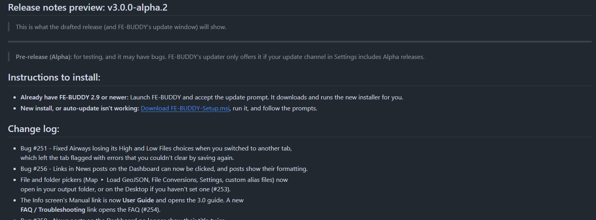

<a id="figure-9"></a>
**Figure 9 - The bypass box (admins only)**

Tick it only for unsigned commits, and only once every check is green.

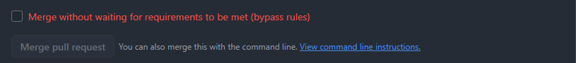

<a id="figure-10"></a>
**Figure 10 - The Release workflow running after the merge**

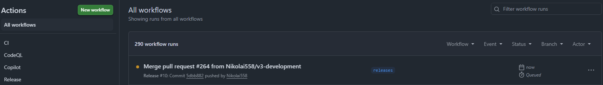

<a id="figure-11"></a>
**Figure 11 - The finished run's summary, with the link to the draft**

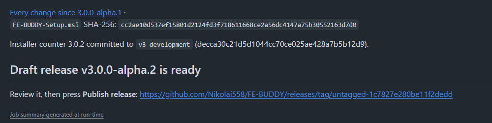

<a id="figure-12"></a>
**Figure 12 - The draft in Releases**

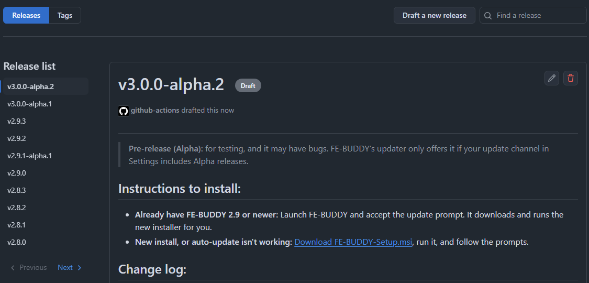

<a id="figure-13"></a>
**Figure 13 - Editing the draft: tag, target and title**

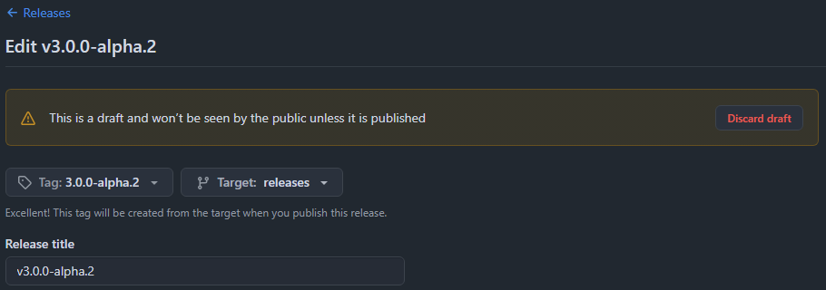

<a id="figure-14"></a>
**Figure 14 - Editing the draft: the MSI, the release label and Publish release**

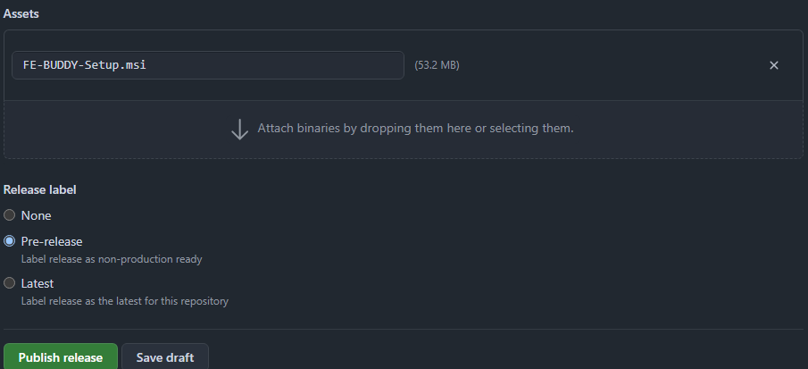

<a id="figure-15"></a>
**Figure 15 - The published release**

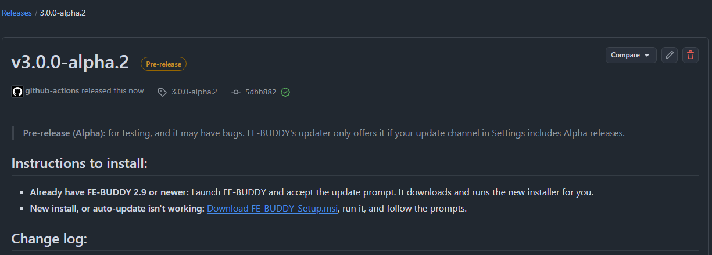
