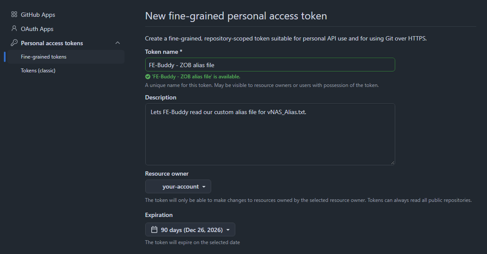
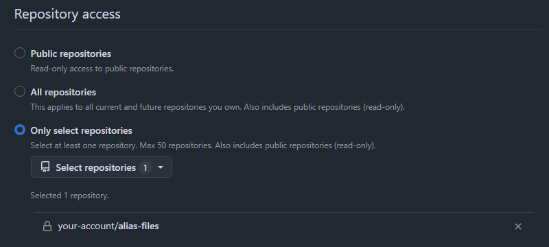
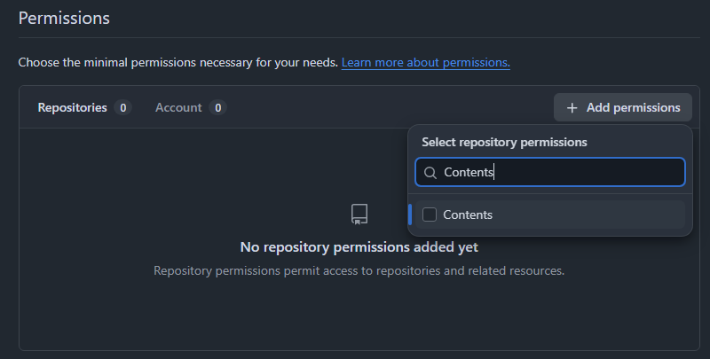
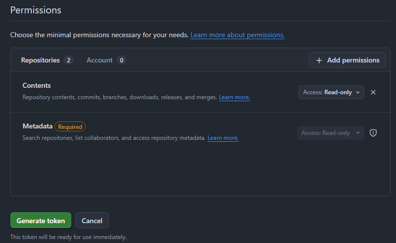
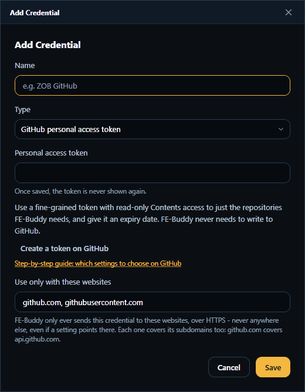

# Creating a GitHub token for FE-Buddy

FE-Buddy needs a GitHub token only to read a file from a **private** GitHub repository - most often
your facility's custom alias file, for the vNAS Alias Upload tab. A file in a public repository
needs no token at all.

This guide makes a **fine-grained personal access token** that can do as little as possible:
read the files of the repositories you pick, and nothing else, for a limited time. FE-Buddy never
writes to GitHub, so it never needs more than that.

## The short version

| Setting on GitHub | Choose |
|---|---|
| Token type | **Fine-grained** (not "classic") |
| Token name | Something you'll recognise, e.g. `FE-Buddy - ZOB alias file` |
| Resource owner | The account or **organization** that owns the repository |
| Expiration | **90 days** (or whatever your facility prefers - never "No expiration") |
| Repository access | **Only select repositories**, then pick just the one(s) with your alias files |
| Repository permissions | **Contents: Read-only** - leave everything else at *No access* |
| Account permissions | None |

Then paste the token into FE-Buddy (Settings ▸ Credentials, or **New credential…** on the vNAS
Alias Upload tab) and press **Check**.

## Step by step

### 1. Open GitHub's "new token" page

In FE-Buddy's credential editor, choose **GitHub personal access token** as the type and click
**Create a token on GitHub**. Your browser opens GitHub's page for a new fine-grained token. Sign
in if GitHub asks - it may also ask for your password or two-factor code again before it lets you
make a token.

To get there without FE-Buddy: click your profile picture (top right) ▸ **Settings** ▸
**Developer settings** (at the bottom of the left-hand menu) ▸ **Personal access tokens** ▸
**Fine-grained tokens** ▸ **Generate new token**.

> Use **Fine-grained tokens**, not **Tokens (classic)**. A classic token with the `repo` scope can
> read *and change* every repository you can reach; a fine-grained one can be limited to one
> repository and to reading.

### 2. Name, owner and expiry

- **Token name** - anything that tells you later what it is for, e.g. `FE-Buddy - ZOB alias file`.
  The **Description** is optional.
- **Resource owner** - who owns the repository with your alias file:
  - your own account, if the repository is under your name; or
  - the **organization**, if it belongs to your facility's GitHub organization (for example
    `vZOB`). An organization is only listed if it allows fine-grained tokens - if yours isn't
    there, ask one of its owners.
- **Expiration** - pick **90 days** (or a custom date up to a year). Avoid *No expiration*: if the
  token ever leaks, an expiry date limits the damage. GitHub emails you a few days before it
  expires; see [When the token expires](#when-the-token-expires).

### 3. Repository access: only the repositories FE-Buddy reads

Choose **Only select repositories**, open the **Select repositories** list, and pick only the
repository (or repositories) that hold your custom alias files. They are listed underneath once
picked.

- Don't choose **All repositories** - FE-Buddy never needs them.
- **Public repositories** is only right for the token in Settings ▸ FE-Buddy's GitHub Requests,
  which just lifts GitHub's limit of 60 requests an hour for FE-Buddy's update checks. A private
  alias file needs **Only select repositories**.

### 4. Permissions: Contents, read-only

Under **Permissions**, with the **Repositories** tab showing, click **Add permissions**, type
`Contents`, and tick **Contents**.

Close the list. You should now see exactly two repository permissions:

- **Contents** - **Access: Read-only**. This is what lets FE-Buddy read the alias file. It starts
  as Read-only; if it says *Read and write*, change it to **Read-only**.
- **Metadata** - marked **Required**, and always **Read-only**. GitHub adds it by itself; it is
  harmless.

Add nothing else, and nothing on the **Account** tab (it should say 0).

> On older versions of the page the permissions are a long list instead: open **Repository
> permissions**, set **Contents** to **Read-only**, and leave everything else at *No access*.

### 5. Generate and copy the token

Click **Generate token** at the bottom of the page. If GitHub shows a summary first, check it -
one or a few repositories, read access to code and metadata, and your expiry date - and confirm.

GitHub now shows the token once - it starts with `github_pat_`. **Copy it straight away**: once
you leave the page, GitHub never shows it again (you would have to regenerate it).

> If the repository belongs to an organization, the token may show **Pending** until an owner of
> the organization approves it. Until then GitHub treats it as if it can't see the repository, and
> FE-Buddy reports that the file was not found.

### 6. Save it in FE-Buddy

In FE-Buddy's credential editor (Settings ▸ Credentials ▸ **Add credential…**, or **New
credential…** next to a web address on the vNAS Alias Upload tab):

1. **Name** - e.g. `ZOB GitHub`.
2. **Type** - **GitHub personal access token**.
3. **Token** - paste the token you copied.
4. **Use only with these websites** - leave it as `github.com, githubusercontent.com`. FE-Buddy
   never sends the token anywhere else.
5. **Save**, then press **Check** next to the credential. *GitHub accepted this token* means it
   works.

FE-Buddy keeps the token in Windows Credential Manager, encrypted with your Windows sign-in. It is
never written to FE-Buddy's settings or to a settings export, and it is never shown again.

Now choose it for your file on the vNAS Alias Upload tab and press **Check** there: it should say
how many alias commands it read. One token can serve several files - an entry on GitHub with no
credential is offered **Use <name>, like file N** when an earlier entry already has one.

## When the token expires

GitHub emails you before it does. When it has expired, FE-Buddy says *GitHub refused the
credential* for the files that use it.

1. On GitHub, open **Settings** ▸ **Developer settings** ▸ **Personal access tokens** ▸
   **Fine-grained tokens**, click the token, and choose **Regenerate token**. It keeps the same
   repositories and permissions; pick a new expiry date.
2. Copy the new token.
3. In FE-Buddy, Settings ▸ Credentials ▸ **Edit…** on the credential, paste the new token into
   **Token**, and **Save**. Everything that used the credential keeps using it.

## If something goes wrong

What FE-Buddy's **Check** says, and what to do about it:

| FE-Buddy says | Most likely | Fix |
|---|---|---|
| GitHub could not find it … if the repository is private, choose a GitHub credential | No credential is chosen for a private repository | Choose your GitHub token for that file |
| GitHub could not find it, or the credential … cannot see it | The repository isn't in the token's **Only select repositories** list; the token is still **Pending** approval; or the **Resource owner** is wrong | Edit the token on GitHub and add the repository, ask an organization owner to approve it, or make a new token with the organization as the owner |
| GitHub refused the credential … mistyped, expired or revoked | The token expired, was deleted, or wasn't pasted in full | Regenerate it on GitHub and paste the new one into the credential |
| GitHub does not let the credential … read it … Contents: Read-only | The token has no **Contents** permission | Edit the token on GitHub and set Contents to Read-only |
| … a GitHub page, not a file | The address is the repository's front page or a folder | Open the alias file itself on GitHub and copy that page's address (it has `/blob/` in it) |

## Keeping the token safe

- Treat it like a password: don't paste it into Discord, an email or a shared document.
- If it may have leaked, delete it on GitHub (**Settings** ▸ **Developer settings** ▸ **Personal
  access tokens** ▸ **Fine-grained tokens** ▸ the token ▸ **Delete**) and make a new one. A
  deleted token stops working at once.
- One token per purpose is easiest to manage - for example one for your facility's alias file,
  and (only if you need it) a separate public-repositories-only one for FE-Buddy's own update
  checks.
